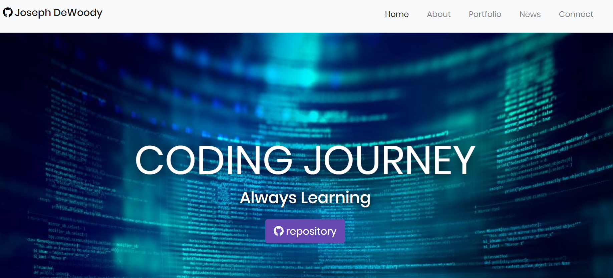

# Joseph DeWoody's Portfolio Website

](https://jquery.com/)

This is where I am learning web development and developing a personal portfolio page of my work. **I have changed totally since my first submission to implement all that I learned in bootstrap**

https://jpd61.github.io/

<a href="https://jpd61.github.io/">Link to deployed application</a>

